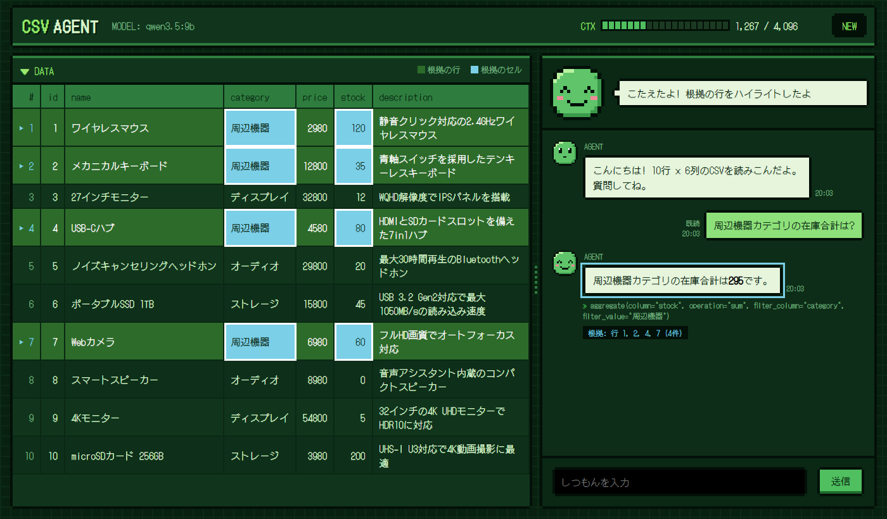

# csv-agent

A small sample AI agent that answers questions about **a single small CSV file**, using a local [Ollama](https://ollama.com) model (`qwen3.5:9b` by default).
Chat with it in a pixel-art web GUI that highlights the rows and cells each answer is based on.



## Requirements

- [uv](https://docs.astral.sh/uv/)
- Ollama running locally with the model pulled: `ollama pull qwen3.5:9b`

## Usage

### GUI

```bash
uv sync
uv run csv-agent-gui data/products.csv   # opens http://127.0.0.1:8000

# Another model or port, without opening a browser
uv run csv-agent-gui data/products.csv --model qwen3.5:4b --port 8080 --no-browser
```

- **Evidence highlighting**: rows and cells the agent used (from its tool calls) are highlighted in the table. Click an answer to show its evidence again.
- **Status face**: shows whether the agent is idle, thinking, calling a tool, done, or failed.
- **Context bar**: tokens of the current conversation against the model's context window. `NEW` starts a new conversation.
- **Layout**: drag the bar between the table and the chat to resize them (double-click resets). The layout also scales with the window and stacks on narrow screens.

### CLI

```bash
# One question
uv run csv-agent data/products.csv "在庫が0の商品は?"

# Interactive session (type exit or quit to leave)
uv run csv-agent data/products.csv

# Show tool calls, use another model, enable thinking mode
uv run csv-agent data/products.csv "一番高い商品は?" -v --model qwen3.5:4b --think
```

Thinking mode (`--think`, available in both GUI and CLI) is off by default to keep responses fast.

### Python

```python
from csv_agent.agent import CsvAgent
from csv_agent.table import Table

agent = CsvAgent(Table.from_csv("data/products.csv"))
print(agent.ask("オーディオカテゴリの在庫合計は?"))
```

## Evaluation

```bash
# Compare models on fixed questions
uv run csv-agent-eval data/products.csv evals/products.json --models qwen3.5:9b qwen3.5:4b

# Record the run in the repository (evals/records/) so the PR check can see it
uv run csv-agent-eval data/products.csv evals/products.json --models qwen3.5:9b --record

# Replace the evaluated models' baselines with this run, e.g. after changing evaluation cases
uv run csv-agent-eval data/products.csv evals/products.json --models qwen3.5:9b --reset-baseline "tightened expected keywords"
```

Before opening a PR, commit your code, run the evaluation with `--record`, and commit `evals/records/`.
The `eval-check` workflow then reports in the job summary (without failing the PR):

- whether a recorded run matches the PR's code (fingerprint of `src/`, `data/`, `evals/`, `uv.lock`),
- per-model accuracy against `evals/records/baseline.json` (a drop of more than 5 points is flagged),
- baselines registered or reset in the PR.

A model's first recorded run becomes its baseline automatically. Run `uv run csv-agent-eval-check` to see the same report locally.

## Tests

```bash
uv run pytest            # unit and GUI browser tests (no Ollama needed)
uv run pytest -m ollama  # end-to-end tests against the local Ollama model
```

GUI tests drive headless Chromium and are skipped until it is installed:

```bash
uv run playwright install chromium-headless-shell
```

## Limitations

- Intended for small CSV files: all rows are held in memory and the BM25 index is built at startup.
- Retrieval is lexical (BM25). Synonyms and paraphrases that share no characters with the data are not matched.
- `aggregate` filters by exact equality only; use `filter_rows` for other conditions.
- The GUI serves one conversation at a time and loads its pixel font from Google Fonts (falls back to a monospace font offline).
