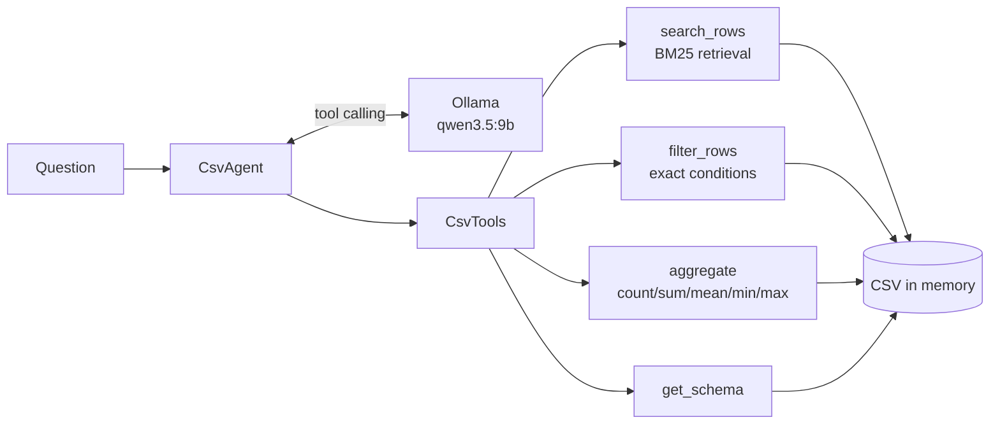

# csv-agent

A small sample AI agent that answers questions about **a single small CSV file**, using a local [Ollama](https://ollama.com) model (`qwen3.5:9b` by default).

## How it works



- The CSV is loaded into memory. Each row becomes a `column: value | ...` document.
- `search_rows` ranks rows with BM25 (`rank-bm25`). Text is NFKC-normalized; ASCII words are kept as words and Japanese runs are split into character bigrams, so no embedding model or Japanese tokenizer is required.
- `filter_rows` and `aggregate` give exact answers for conditions and arithmetic, which keyword retrieval alone cannot.
- The schema is placed in the system prompt; the model decides which tools to call and answers from their results, citing row numbers.

| Module | Role |
| --- | --- |
| `table.py` | CSV loading (UTF-8 / UTF-8 with BOM) |
| `retriever.py` | Tokenizer and BM25 retriever |
| `tools.py` | Tools exposed to the model. Errors are returned as JSON so the model can retry |
| `agent.py` | Tool-calling loop over the Ollama chat API, conversation history |
| `cli.py` | Command line interface |

## Requirements

- [uv](https://docs.astral.sh/uv/)
- Ollama running locally with the model pulled: `ollama pull qwen3.5:9b`

## Usage

```bash
uv sync

# One question
uv run csv-agent data/products.csv "在庫が0の商品は?"

# Interactive session (type exit or quit to leave)
uv run csv-agent data/products.csv

# Show tool calls, use another model, enable thinking mode
uv run csv-agent data/products.csv "一番高い商品は?" -v --model qwen3.5:4b --think
```

From Python:

```python
from csv_agent.agent import CsvAgent
from csv_agent.table import Table

agent = CsvAgent(Table.from_csv("data/products.csv"))
print(agent.ask("オーディオカテゴリの在庫合計は?"))
```

Thinking mode is off by default to keep responses fast.

## Tests

```bash
uv run pytest            # unit tests (no Ollama needed)
uv run pytest -m ollama  # end-to-end tests against the local Ollama model
```

- `tests/unit`: contract-level tests. The agent loop is tested with a scripted fake client that returns real `ollama.ChatResponse` objects.
- `tests/integration`: a few end-to-end questions against `data/products.csv` (lookup, aggregate, condition). Skipped when the model is not available. Answers are checked by keywords, so results can vary with model output.

## Limitations

- Intended for small CSV files: all rows are held in memory and the BM25 index is built at startup.
- Retrieval is lexical (BM25). Synonyms and paraphrases that share no characters with the data are not matched.
- `aggregate` filters by exact equality only; use `filter_rows` for other conditions.
